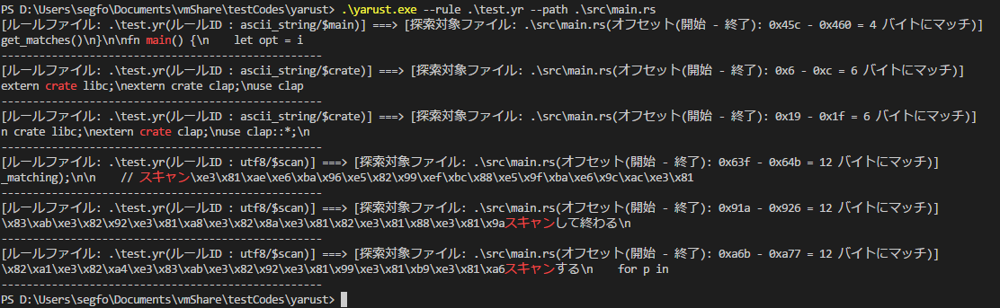

# これはなに？
[libyara](https://github.com/VirusTotal/yara/)を使ってバイナリGrepできるツール  
対応OSはWindowsのみ。（将来的にはLinuxもやりたい予定）  
  
### (祝)マルチスレッド対応  
  
[ルールを定義して使ってみたQiita](https://qiita.com/segfo/items/ea0af9ffefc862a91152)  
  
## 使い方  
  
`yarust.exe --rule rule.yr --path ./`  
  
こうすると、rule.yrに従ってディレクトリまたはファイルをスキャンして、一致した箇所を出してくれる  
バイナリ、ログファイルやDBファイルの調査に使えるかも。  
  
# スクリーンショット


# 日本語ヘルプ
```
yarust 2.2.0
segfo <k.segfo@gmail.com>


USAGE:
    yarust.exe [OPTIONS] --rule <rule_file> --path <search_path>

FLAGS:
    -h, --help       Prints help information
    -V, --version    Prints version information

OPTIONS:
    -l, --logfile <redirect_file_path>    ログ出力ファイルのパスを指定する
    -r, --rule <rule_file>       YARAルールのファイルパスを指定する
    -w, --width <scope_width>    一致箇所から表示する前後任意のバイト数を指定(デフォルト20バイト)
    -p, --path <search_path>     探索対象のファイルかディレクトリのパスを指定する
    -t, --threads <threads_count>         スキャンスレッド数（同時にスキャンするファイル数）を指定する
```

# Google翻訳した英語ヘルプ
```
yarust 2.2.0
segfo <k.segfo@gmail.com>


USAGE:
    yarust.exe [OPTIONS] --rule <rule_file> --path <search_path>

FLAGS:
    -h, --help       Prints help information
    -V, --version    Prints version information

OPTIONS:
    -l, --logfile <redirect_file_path>    Specify log file path
    -r, --rule <rule_file>                Specify file path of YARA rule
    -w, --width <scope_width>             Specify an arbitrary number of bytes before and after display from the
                                          matching part (default 20 bytes)
    -p, --path <search_path>              Specify the path of the search target file or directory
    -t, --threads <threads_count>         Specify the count of threads
```

